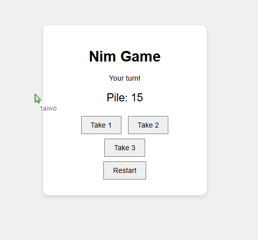

# Nim Game

## 1. How to Run the Game
- Open the `index.html` file in the `AI Games/Nim game/` folder using any modern web browser (e.g., Chrome, Firefox, Edge).
- No installation is required; simply double-click the file or right-click and choose "Open with" your browser.

## 2. Software/Library/Framework Requirements
- No additional software, libraries, or frameworks need to be pre-installed. The game runs entirely in the browser using HTML, CSS, and JavaScript.

## 3. How to Play
- The game starts with a certain number of objects (e.g., sticks or stones).
- Players take turns removing 1, 2, or 3 objects from the pile.
- The player forced to take the last object loses (or wins, depending on the variant; check the game instructions on the page).
- Click on the objects or use the provided controls to make your move.
- The AI will make its move after yours.
- Click the "Restart" button to play again.

## 4. Images/Screenshots

## 5. Algorithm Used
- The AI uses the **Nim Sum (binary XOR) strategy**, which is the optimal solution for the classic Nim game. This ensures the AI plays optimally and cannot be beaten if it goes first and the initial configuration is not a losing position.
