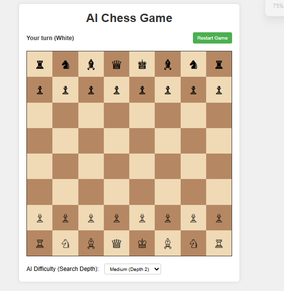

# Chess

## 1. How to Run the Game
- Open the `index.html` file in the `AI Games/chess/` folder using any modern web browser (e.g., Chrome, Firefox, Edge).
- No installation is required; simply double-click the file or right-click and choose "Open with" your browser.

## 2. Software/Library/Framework Requirements
- No additional software, libraries, or frameworks need to be pre-installed. The game runs entirely in the browser using HTML, CSS, and JavaScript.

## 3. How to Play
- Play chess against the AI by clicking and dragging pieces on the board.
- Standard chess rules apply (pawn movement, castling, en passant, promotion, etc.).
- The AI will make its move after yours.
- The game ends with checkmate, stalemate, or draw.
- Click the "Restart" button to start a new game.

## 4. Images/Screenshots

## 5. Algorithm Used
- The AI uses the **Minimax algorithm with Alpha-Beta Pruning** to determine its moves. This allows the AI to search possible moves efficiently and play competitively.
