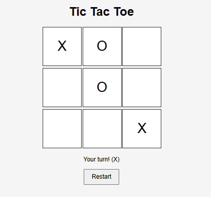

# Tic Tac Toe - Smart AI

## 1. How to Run the Game
- Open the `index.html` file in the `AI Games/tic-tac-toe/` folder using any modern web browser (e.g., Chrome, Firefox, Edge).
- No installation is required; simply double-click the file or right-click and choose "Open with" your browser.

## 2. Software/Library/Framework Requirements
- No additional software, libraries, or frameworks need to be pre-installed. The game runs entirely in the browser using HTML, CSS, and JavaScript.

## 3. How to Play
- The game is played on a 3x3 grid.
- You play as "X" and the AI plays as "O".
- Click on any empty cell to make your move.
- The AI will automatically make its move after yours.
- The first player to get three of their marks in a row (vertically, horizontally, or diagonally) wins.
- If all cells are filled and no player has three in a row, the game is a draw.
- Click the "Restart" button to play again.

## 4. Images/Screenshots

## 5. Algorithm Used
- The AI uses the **Minimax algorithm** to determine the optimal move. This ensures the AI plays optimally and cannot be beaten.
