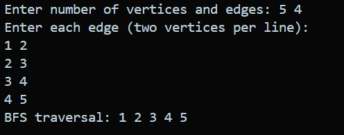
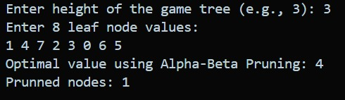
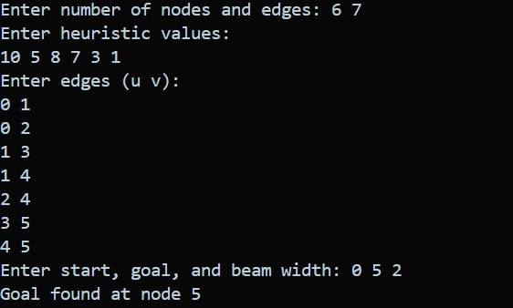
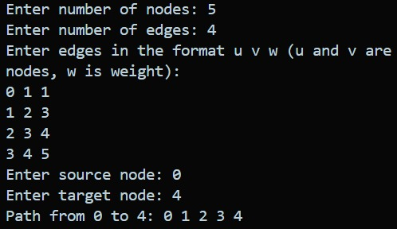
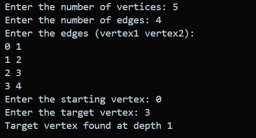
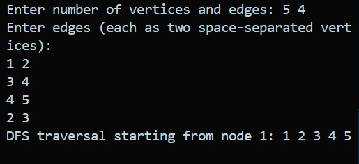
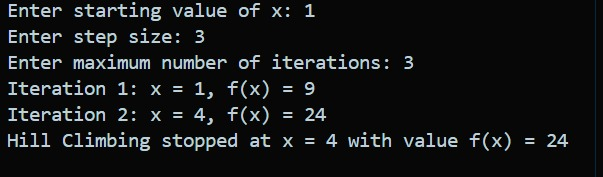
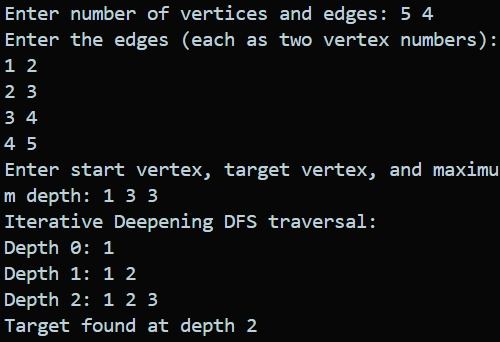
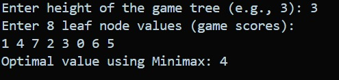

# Algorithm Implementations

This document provides an overview of the algorithms implemented in this folder, including how each works, their applications, time and space complexity, and sample input/output images.

---

## 1. A* Search
**How it works:**
A* is a best-first search algorithm that finds the shortest path from a start node to a target node using a heuristic to estimate the cost to reach the goal. It combines the advantages of Dijkstra's Algorithm and Greedy Best-First Search.

**Applications:**
- Pathfinding in games
- Robot navigation
- Network routing

**Complexity:**
- Time: O(E) (worst case, E = number of edges)
- Space: O(V) (V = number of vertices)

**Image:**

---

## 2. Alpha-Beta Pruning
**How it works:**
Alpha-beta pruning is an optimization for the minimax algorithm that eliminates branches in the game tree that cannot affect the final decision, improving efficiency.

**Applications:**
- Game AI (chess, tic-tac-toe)
- Decision making in adversarial games

**Complexity:**
- Time: O(b^(d/2)) (b = branching factor, d = depth)
- Space: O(d)

**Image:**

---

## 3. Beam Search
**How it works:**
Beam search is a heuristic search algorithm that explores a graph by expanding only a limited set of the most promising nodes at each depth, controlled by the beam width.

**Applications:**
- Speech recognition
- Machine translation
- Pathfinding

**Complexity:**
- Time: O(bw * d) (bw = beam width, d = depth)
- Space: O(bw * d)

**Image:**

---

## 4. Best First Search
**How it works:**
Best First Search explores a graph by expanding the most promising node chosen according to a specified rule or heuristic.

**Applications:**
- Pathfinding
- Puzzle solving

**Complexity:**
- Time: O(E)
- Space: O(V)

**Image:**

---

## 5. Breadth-First Search (BFS)
**How it works:**
BFS explores all neighbors at the present depth before moving on to nodes at the next depth level. It uses a queue to keep track of nodes to visit.

**Applications:**
- Shortest path in unweighted graphs
- Web crawlers
- Social network analysis

**Complexity:**
- Time: O(V + E)
- Space: O(V)

**Image:**

---

## 6. Bidirectional Search
**How it works:**
Bidirectional search runs two simultaneous searches—one forward from the start and one backward from the goal—until they meet.

**Applications:**
- Shortest path problems
- Route finding

**Complexity:**
- Time: O(b^(d/2))
- Space: O(b^(d/2))

**Image:**

---

## 7. Depth Limited Search
**How it works:**
Depth Limited Search is a DFS variant with a predetermined depth limit. It avoids going deeper than the set limit.

**Applications:**
- Game tree search
- Solving puzzles with depth constraints

**Complexity:**
- Time: O(b^l) (l = depth limit)
- Space: O(l)

**Image:**

---

## 8. Depth-First Search (DFS)
**How it works:**
DFS explores as far as possible along each branch before backtracking. It uses a stack (explicit or via recursion).

**Applications:**
- Topological sorting
- Cycle detection
- Pathfinding

**Complexity:**
- Time: O(V + E)
- Space: O(V)

**Image:**

---

## 9. Hill Climbing
**How it works:**
Hill climbing is an iterative algorithm that starts with an arbitrary solution and makes incremental changes, each time moving to a neighbor with a better value, until no improvement is possible.

**Applications:**
- Optimization problems
- Machine learning (feature selection)

**Complexity:**
- Time: O(iterations)
- Space: O(1)

**Image:**

---

## 10. Iterative Deepening
**How it works:**
Iterative Deepening combines the space efficiency of DFS with the optimality of BFS by repeatedly running DFS with increasing depth limits.

**Applications:**
- Game tree search
- Pathfinding

**Complexity:**
- Time: O(b^d)
- Space: O(d)

**Image:**

---

## 11. Minimax
**How it works:**
Minimax is a recursive algorithm used in decision making and game theory to find the optimal move for a player, assuming the opponent also plays optimally.

**Applications:**
- Game AI (tic-tac-toe, chess)
- Adversarial search

**Complexity:**
- Time: O(b^d)
- Space: O(d)

**Image:**

---

> **Note:** For more details, refer to the code files and images in the respective folders.
